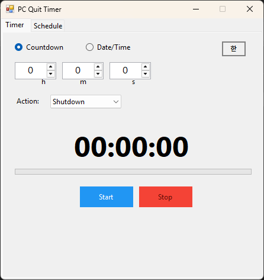
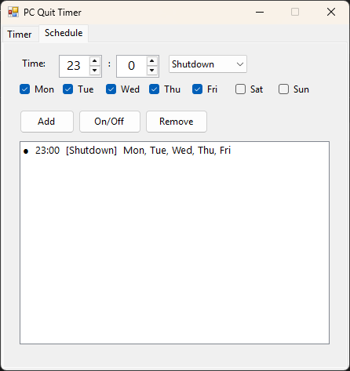

# PC Quit Timer

A Windows desktop app to schedule PC shutdown, restart, sleep, and other power actions.

## Features

- **Timer modes**: Countdown (hours/minutes/seconds) or specific date/time
- **6 power actions**: Shutdown / Restart / Sleep / Hibernate / Log off / Lock
- **Recurring schedules**: Daily/weekly auto-execution at a set time
- **Live countdown**: Remaining time display with progress bar

## Download

Download `PcQuitTimer.exe` from the [Releases](../../releases) page.

- No installation required (single exe file)
- Windows 10/11 supported
- Based on .NET Framework 4.8 (built into Windows)

## Screenshots

| Timer | Schedule |
|-------|----------|
|  |  |

## Build

```bash
# WinForms (lightweight, 18KB)
dotnet publish src/PcQuitTimer.WinForms/PcQuitTimer.WinForms.csproj -c Release

# WPF (MaterialDesign UI, 65MB self-contained)
dotnet publish src/PcQuitTimer/PcQuitTimer.csproj -c Release -r win-x64 --self-contained -p:PublishSingleFile=true -p:EnableCompressionInSingleFile=true
```

## Project Structure

```
src/
├── PcQuitTimer/              # WPF version (.NET 10, MaterialDesign)
└── PcQuitTimer.WinForms/     # WinForms version (.NET Framework 4.8, lightweight)
```

## License

MIT
