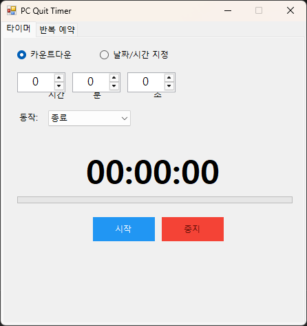
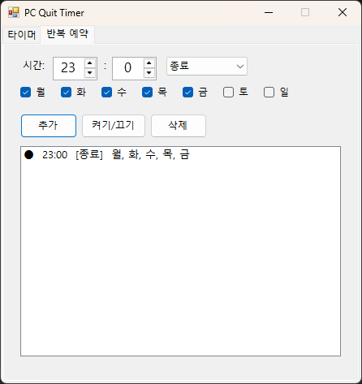

# PC Quit Timer

[English](README.en.md)

Windows PC 종료/재시작/절전 등을 예약할 수 있는 타이머 앱입니다.

## 기능

- **타이머 모드**: 카운트다운(시/분/초) 또는 특정 날짜/시간 지정
- **6가지 전원 동작**: 종료 / 재시작 / 절전 / 최대 절전 / 로그오프 / 잠금
- **반복 예약**: 매일/매주 특정 시간에 자동 실행
- **실시간 카운트다운**: 남은 시간 표시 + 프로그레스바

## 다운로드

[Releases](../../releases) 페이지에서 `PcQuitTimer.exe`를 다운로드하세요.

- 별도 설치 불필요 (exe 단일 파일)
- Windows 10/11 지원
- .NET Framework 4.8 기반 (Windows 기본 내장)

## 스크린샷

| 타이머 | 반복 예약 |
|--------|----------|
|  |  |

## 빌드

```bash
# WinForms (경량, 18KB)
dotnet publish src/PcQuitTimer.WinForms/PcQuitTimer.WinForms.csproj -c Release

# WPF (MaterialDesign UI, 65MB self-contained)
dotnet publish src/PcQuitTimer/PcQuitTimer.csproj -c Release -r win-x64 --self-contained -p:PublishSingleFile=true -p:EnableCompressionInSingleFile=true
```

## 프로젝트 구조

```
src/
├── PcQuitTimer/              # WPF 버전 (.NET 10, MaterialDesign)
└── PcQuitTimer.WinForms/     # WinForms 버전 (.NET Framework 4.8, 경량)
```

## License

MIT
